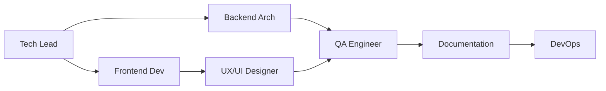
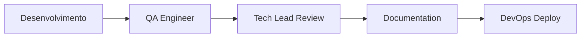

# Agentes de IA Especializados - Time de Desenvolvimento Web

Este diretório contém agentes de inteligência artificial especializados em diferentes áreas de desenvolvimento web para o projeto Vorix. Cada agente possui expertise específica e deve ser consultado conforme a tarefa em questão.

## 📋 Índice de Agentes

### 1. [Frontend Developer](./frontend-developer.md)
**Especialidade**: React, Componentes, UI/UX, Animações

**Quando usar**:
- Criar ou modificar componentes React
- Implementar layouts e interfaces
- Adicionar animações com Framer Motion
- Trabalhar com Tailwind CSS e estilização
- Resolver problemas de responsividade
- Implementar interações do usuário
- Otimizar performance de componentes

**Keywords**: `componente`, `UI`, `interface`, `layout`, `animação`, `estilo`, `Tailwind`, `Framer Motion`

---

### 2. [Backend Architect](./backend-architect.md)
**Especialidade**: APIs, Arquitetura de Dados, Estado, Integração

**Quando usar**:
- Planejar arquitetura de dados
- Implementar gerenciamento de estado
- Integrar APIs e serviços externos
- Criar hooks customizados para dados
- Estruturar fluxo de dados da aplicação
- Implementar autenticação/autorização
- Otimizar fetching de dados

**Keywords**: `API`, `dados`, `estado`, `fetch`, `integração`, `backend`, `hooks`, `context`

---

### 3. [DevOps Engineer](./devops-engineer.md)
**Especialidade**: Build, Deploy, CI/CD, Performance, Infraestrutura

**Quando usar**:
- Configurar build e deploy
- Otimizar performance de build
- Configurar CI/CD pipelines
- Resolver problemas de ambiente
- Configurar variáveis de ambiente
- Deploy em diferentes plataformas
- Monitoramento e analytics

**Keywords**: `build`, `deploy`, `CI/CD`, `vite`, `performance`, `otimização`, `ambiente`

---

### 4. [QA Engineer](./qa-engineer.md)
**Especialidade**: Testes, Qualidade, Debugging, Validação

**Quando usar**:
- Escrever testes unitários e de integração
- Configurar testing framework
- Criar estratégias de teste
- Debugar problemas complexos
- Validar acessibilidade
- Testar cross-browser
- Garantir qualidade de código

**Keywords**: `teste`, `test`, `debug`, `qualidade`, `bug`, `validação`, `Jest`, `Testing Library`

---

### 5. [UX/UI Designer](./ux-ui-designer.md)
**Especialidade**: Design System, Acessibilidade, UX, Responsividade

**Quando usar**:
- Criar/manter design system
- Garantir acessibilidade (WCAG)
- Melhorar experiência do usuário
- Criar variantes de componentes
- Implementar design responsivo
- Trabalhar com cores e tipografia
- Criar animações e micro-interações

**Keywords**: `design`, `acessibilidade`, `UX`, `responsivo`, `cores`, `tipografia`, `a11y`

---

### 6. [Tech Lead](./tech-lead.md)
**Especialidade**: Arquitetura Geral, Code Review, Padrões, Decisões Técnicas

**Quando usar**:
- Tomar decisões arquiteturais
- Definir padrões de código
- Revisar código complexo
- Refatorar código legado
- Resolver problemas técnicos complexos
- Planejar features grandes
- Mentorar sobre boas práticas

**Keywords**: `arquitetura`, `padrões`, `review`, `refatoração`, `decisão técnica`, `planejamento`

---

### 7. [Documentation Specialist](./documentation-specialist.md)
**Especialidade**: Documentação Técnica, READMEs, Guides, Tutoriais

**Quando usar**:
- Criar ou atualizar documentação
- Escrever READMEs
- Documentar componentes e APIs
- Criar guias de uso
- Escrever tutoriais
- Documentar padrões de código
- Criar changelogs

**Keywords**: `documentação`, `readme`, `docs`, `guia`, `tutorial`, `changelog`

---

## 🎯 Guia Rápido de Uso

### Por Tipo de Tarefa

#### Criar Nova Funcionalidade
1. **Tech Lead** - Planejar arquitetura
2. **Frontend Developer** - Implementar UI
3. **Backend Architect** - Implementar lógica de dados
4. **QA Engineer** - Criar testes
5. **Documentation Specialist** - Documentar

#### Resolver Bug
1. **QA Engineer** - Reproduzir e diagnosticar
2. **Frontend Developer** ou **Backend Architect** - Corrigir (conforme natureza do bug)
3. **Tech Lead** - Review se for complexo

#### Melhorar Performance
1. **DevOps Engineer** - Build e deploy
2. **Frontend Developer** - Otimizar componentes
3. **Backend Architect** - Otimizar dados

#### Adicionar Novo Componente
1. **UX/UI Designer** - Design e acessibilidade
2. **Frontend Developer** - Implementação
3. **QA Engineer** - Testes
4. **Documentation Specialist** - Documentar

#### Deploy e Infraestrutura
1. **DevOps Engineer** - Configurar e executar
2. **Tech Lead** - Validar estratégia

---

## 📝 Como Usar os Agentes

### Formato de Consulta

Ao consultar um agente, forneça:

1. **Contexto**: Descrição do problema/tarefa
2. **Objetivo**: O que você quer alcançar
3. **Restrições**: Limitações ou requisitos específicos
4. **Arquivos relevantes**: Paths dos arquivos envolvidos

### Exemplo

```
Agente: Frontend Developer

Contexto: Preciso criar um novo card para exibir depoimentos de clientes
Objetivo: Card responsivo com animação de entrada e hover effect
Restrições: Deve seguir o design system existente (cores, espaçamento)
Arquivos: src/components/general/TestimonialCard.tsx (novo)

[Descrição detalhada da tarefa]
```

---

## 🔄 Fluxo de Trabalho Colaborativo

### Desenvolvimento de Feature



### Ciclo de Qualidade



---

## 🎓 Expertise de Cada Agente

| Agente | React | TypeScript | Tailwind | Framer Motion | Vite | Testing | Deploy | Design |
|--------|-------|------------|----------|---------------|------|---------|--------|--------|
| Frontend Developer | ⭐⭐⭐⭐⭐ | ⭐⭐⭐⭐ | ⭐⭐⭐⭐⭐ | ⭐⭐⭐⭐⭐ | ⭐⭐⭐ | ⭐⭐ | ⭐ | ⭐⭐⭐ |
| Backend Architect | ⭐⭐⭐ | ⭐⭐⭐⭐⭐ | ⭐ | ⭐ | ⭐⭐ | ⭐⭐⭐ | ⭐⭐ | ⭐ |
| DevOps Engineer | ⭐⭐ | ⭐⭐⭐ | ⭐ | ⭐ | ⭐⭐⭐⭐⭐ | ⭐⭐ | ⭐⭐⭐⭐⭐ | ⭐ |
| QA Engineer | ⭐⭐⭐ | ⭐⭐⭐⭐ | ⭐⭐ | ⭐ | ⭐⭐ | ⭐⭐⭐⭐⭐ | ⭐⭐ | ⭐⭐ |
| UX/UI Designer | ⭐⭐⭐ | ⭐⭐ | ⭐⭐⭐⭐⭐ | ⭐⭐⭐⭐ | ⭐ | ⭐ | ⭐ | ⭐⭐⭐⭐⭐ |
| Tech Lead | ⭐⭐⭐⭐ | ⭐⭐⭐⭐⭐ | ⭐⭐⭐ | ⭐⭐⭐ | ⭐⭐⭐⭐ | ⭐⭐⭐⭐ | ⭐⭐⭐ | ⭐⭐⭐ |
| Documentation | ⭐⭐⭐ | ⭐⭐⭐ | ⭐⭐ | ⭐⭐ | ⭐⭐ | ⭐⭐ | ⭐⭐ | ⭐⭐ |

---

## 📚 Referências

Todos os agentes têm acesso completo à documentação do projeto:

- [Documentação Principal](../docs/README.md)
- [Architecture](../docs/03-architecture.md)
- [Component Patterns](../docs/04-component-patterns.md)
- [Styling Guide](../docs/05-styling-guide.md)
- [TypeScript Conventions](../docs/07-typescript-conventions.md)
- [Coding Standards](../docs/12-coding-standards.md)

---

## 🚀 Quick Start

1. **Identifique o tipo de tarefa**
2. **Escolha o agente apropriado** (use a tabela acima)
3. **Consulte o arquivo do agente** para instruções detalhadas
4. **Forneça contexto claro** sobre sua necessidade
5. **Siga as recomendações** do agente especializado

---

**Dica**: Para tarefas complexas, consulte múltiplos agentes em sequência. Por exemplo: Tech Lead → Frontend Developer → QA Engineer → Documentation Specialist.
